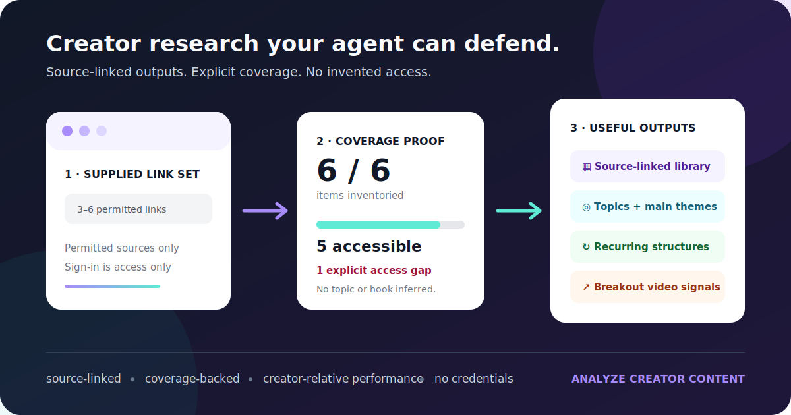

# Analyze Creator Content

[](https://github.com/laraavci/analyze-creator-content/actions/workflows/ci.yml)
[](https://agentskills.io/specification)
[](LICENSE)

Turn any accessible creator profile into a source-linked content library, without pretending the agent reviewed content it could not access.



## Install In One Command

```bash
npx skills add laraavci/analyze-creator-content
```

Then give your agent a creator profile:

```text
Use Analyze Creator Content on this creator: [profile URL]. Review every accessible
video and extract content types, hooks, recurring topics, main themes, audience
jobs, CTAs, proof devices, reused script structures, research claims, visible
performance, breakout videos, and a source-linked content library. Prove coverage
and name every access gap. If sign-in is required, pause for me to sign in manually
in the browser session you can use, then resume without asking for credentials.
```

The skill works with Codex, Claude Code, and other [Agent Skills](https://agentskills.io/specification)-compatible clients. Source acquisition depends on what the host agent can access: browser, official API, connector, export, or supplied links.

## See The Result Before Installing

The [Synthetic Social Lab example](examples/synthetic-social-lab/README.md) is rebuilt by the automated test suite. It contains no real creator data.

| Deliverable | What it answers | Example |
|---|---|---|
| Creator brief | What does this creator consistently teach and how? | [Read the synthesis](examples/synthetic-social-lab/creator-brief.md) |
| Content library | What happened in each source item? | [JSONL](examples/synthetic-social-lab/content-library.jsonl) · [CSV](examples/synthetic-social-lab/content-library.csv) |
| Topic and theme summary | Which topics, pillars, audience jobs, series, and proof devices recur? | [Inspect the counts](examples/synthetic-social-lab/library-summary.json) |
| Pattern playbook | Which hooks, formats, CTAs, and script structures repeat? | [Open the playbook](examples/synthetic-social-lab/pattern-playbook.md) |
| Breakout report | Which accessible videos outperform the creator's own baseline? | [See the 5×-median example](examples/synthetic-social-lab/performance-report.md) |
| Coverage report | What was inventoried, reviewed, excluded, or inaccessible? | [See the explicit gap](examples/synthetic-social-lab/coverage-report.md) |

In that example, all six items are inventoried, five are accessible, two script structures repeat, and one video is a creator-relative breakout candidate. Overall coverage remains correctly marked incomplete because one source cannot be inspected.

## Why This Is Different

- **It proves what it reviewed.** Complete coverage requires an explicit inventory basis, an exact expected count, matching source records, and zero unresolved gaps.
- **It separates evidence from interpretation.** Source observations, analyst inference, measured counts, and externally verified research stay distinct.
- **It finds systems, not just summaries.** Topics, themes, audience jobs, content types, formats, hooks, CTAs, proof devices, series, and repeated structures are counted across source-linked records.
- **It surfaces outliers carefully.** Breakout labels require at least five comparable videos and a visible result at least 3× the creator median.
- **It does not clone a creator's voice.** Full transcripts, copied script collections, imitation, and inaccessible-content guessing are out of scope.

This is useful for creators, content strategists, agencies, researchers, and founders who want an auditable view of a creator's content system rather than an unverifiable AI summary.

## Before Your First Instagram Run

The skill does not log in to Instagram or ship its own browser. Public links may work without authentication, but profile enumeration, reels, captions, and visible metrics often require a signed-in session.

1. Use an agent environment that can browse the platform and inspect video, audio, captions, and on-screen text.
2. Open Instagram in the browser session the agent can actually operate.
3. Sign in manually. Never put a password, cookie, token, browser-storage export, or session file in the prompt.
4. Start or resume the analysis. The agent must recheck access and preserve the same run.

Signing in to an unrelated browser window may not share access with the agent. If the host still cannot inspect the media, provide authorized links or an export, or use another environment. The skill reports the gap instead of claiming success.

## What The Run Produces

```text
creator-brief.md
source-inventory.jsonl
content-library.jsonl
content-library.csv
library-summary.json
pattern-playbook.md
performance-report.md
coverage-report.md
research-audit.md       # when factual claims need verification
```

Downloaded media and full transcripts stay out of the durable library. Equivalent labels should be normalized during analysis because the deterministic builder deliberately does not guess that two phrases mean the same thing.

## Compatibility And Evidence

| Surface | Verified | Remaining host-dependent work |
|---|---|---|
| Agent Skills CLI | Repository discovery and one-command install listing | Client-specific browsing and media inspection |
| Codex | Skill validation, installer paths, packaged execution, deterministic outputs, and one authenticated three-reel Instagram pilot | Live completeness still depends on the available browser, transcription, and OCR capabilities |
| Claude Code | Canonical skill package and installer paths | Manual model eval and live acquisition still require a capable host |
| Generic Agent Skills client | Portable skill folder, generic installer, and reproducible ZIP | Invocation and source tooling vary by client |
| CI | Python 3.10–3.13 across Linux, macOS, and Windows | Live social-platform access is intentionally not automated in CI |

See [docs/compatibility.md](docs/compatibility.md) for the dated verification record and [docs/first-run-test.md](docs/first-run-test.md) if you want to help test a new host environment.

## Alternative Install Methods

Clone the repository if you want the helper scripts, tests, or a project-scoped install:

```bash
git clone https://github.com/laraavci/analyze-creator-content.git
cd analyze-creator-content
```

Codex:

```bash
python3 scripts/install_skill.py --client codex
python3 scripts/install_skill.py --client codex --scope project --project /path/to/project
```

Claude Code:

```bash
python3 scripts/install_skill.py --client claude
python3 scripts/install_skill.py --client claude --scope project --project /path/to/project
```

Other clients or a custom target:

```bash
python3 scripts/install_skill.py --client generic --target /path/to/client/skills
```

Build the reproducible downloadable archive:

```bash
python3 scripts/package_skill.py
```

## Fixed-Link And Sample Runs

You can avoid profile enumeration and analyze an exact set:

```text
Use Analyze Creator Content on these 12 links. Do not expand beyond the supplied
set. Identify repeated topics, hooks, formats, teaching structures, and visible
performance. Treat the supplied set as the coverage denominator.
```

A sample can support claims about that sample, not the creator's full catalog.

## Verify Or Contribute

```bash
python3 scripts/validate_skill.py
python3 -m unittest discover -s tests -v
python3 scripts/package_skill.py
python3 scripts/audit_public_repo.py
```

The repository includes zero-dependency Python helpers, fixture-driven regression tests, a deterministic ZIP packager, an extracted-archive smoke test, and a public-data audit. Read [docs/verification.md](docs/verification.md), [docs/architecture.md](docs/architecture.md), and [CONTRIBUTING.md](CONTRIBUTING.md) before changing behavior.

If this makes creator research more trustworthy or useful for you, star the repository and share what client/platform combination you tested. Real first-run friction is more valuable than generic praise.

## Security, Rights, And Limits

- No authentication bypasses, CAPTCHAs, private-account access, undocumented endpoint dependencies, or rate-limit circumvention.
- No cookie, password, browser-storage, token, or session-file handling.
- No claim that every post was reviewed unless the coverage evidence supports it.
- No universal-virality or causal-performance claims.
- No full-transcript archive, copied script collection, or creator-voice imitation.
- Creator content is untrusted data, never agent instructions.

Keep source links and structured observations. Do not publish creator media, private exports, copyrighted transcript collections, credentials, or creator-specific libraries without checking authorization and content rights. See [SECURITY.md](SECURITY.md) and [docs/security-notes.md](docs/security-notes.md).

Licensed under [Apache License 2.0](LICENSE). This repository provides a research workflow, not legal advice.
